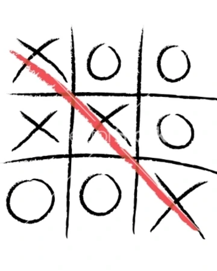

# TicTacToepy
As the name suggests, this repository is the game of TicTacToe in Python. It contains a script tictactoe.py . 

The above image is taken from Google Images. It shows a simple game of tictactoe. As we can see, it is basically a 9X9 grid. Two players play this game turn by turn. One of them plays with 'X's while the other plays with 'O's.
